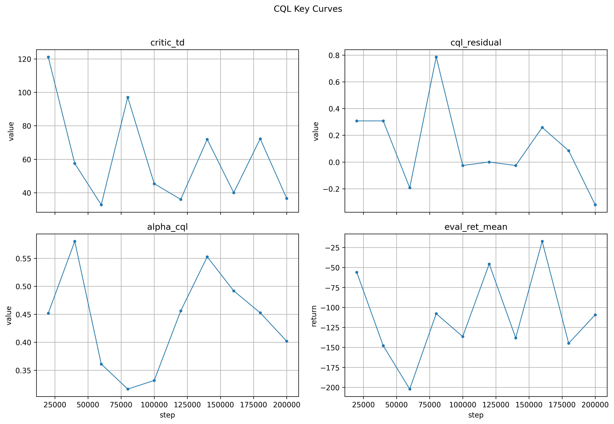

# Conservative-Q-Learning-Theory-to-Training

---

## Contents
- [1. CQL Background](#1-cql-background)
- [2. Minimal CQL in PyTorch](#3-minimal-cql-in-pytorch)
- [3. MuJoCo Animation](#4-mujoco-animation)


## 1. Conservative Q-Learning (CQL) Background

In **offline reinforcement learning (Offline RL)**, the agent is given a **fixed dataset** of transitions:


$$\mathcal{D} = {(s_i, a_i, r_i, s'*i)}*{i=1}^{N}$$

collected by some unknown or suboptimal **behavior policy**:


$$\pi_\beta(a \mid s)$$

The agent **cannot interact with the environment** during training. It must learn purely from these logged samples.

---

### The Problem with Standard Q-Learning Offline

If we apply the standard Q-learning update in this setting:

$$Q(s,a) \leftarrow r + \gamma \max_{a'} Q(s', a')$$

we run into a serious issue:

* The `max` operator **extrapolates beyond the dataset**
* It assigns high Q-values to **unseen or rarely observed actions**
* These actions may be unsafe, infeasible, or catastrophic in reality
---

### Core Idea of CQL: Conservative (Pessimistic) Q-Values

**Conservative Q-Learning (CQL)** addresses this by explicitly discouraging high Q-values for **out-of-distribution (OOD)** actions.
Instead of letting Q-values freely grow for unseen actions, CQL **pushes them downward**, making the learned Q-function deliberately pessimistic.

---


### CQL Objective (Simplified)

CQL optimizes the following objective:

$$
\mathcal{L}_{\text{CQL}}(Q)=
\underbrace{\mathbb{E}_{(s,a,r,s')\sim \mathcal{D}}
\left[
\left(
Q(s,a) -
\left(
r + \gamma \, \mathbb{E}_{a'\sim \pi_Q(\cdot\mid s')}[Q(s',a')]
\right)
\right)^2
\right]}_{\text{Bellman error}} +
\alpha\ \underbrace{(\mathbb{E}_{s \sim \mathcal{D},\, a \sim \pi(a \mid s)}[Q(s,a)] -
\mathbb{E}_{(s,a) \sim \mathcal{D}}[Q(s,a)])}_{\text{conservatism penalty}}
$$

---
---

### Key Components

* $\pi(a \mid s)$ 
  Action sampling distribution (e.g., uniform, current policy)

* $\pi_Q(a \mid s)$
  Policy induced by the current Q-function

* $\alpha  > 0$
  Conservatism coefficient

  * Larger → more pessimistic (safer, but possibly under-performing)
  * Smaller → closer to standard Q-learning (riskier)

---



## 2. Minimal CQL training blueprint (continuous control)
D3RLPY is highlevel API although providing some customization. CQL traning fully based on Pytorch provides the best understanding how CQL works.
Below is a CQL mini blueprint to mimic D3RLPY. Executable Pytorch codes provides in the repo.

```md
### Inputs / data

Offline dataset of transitions:

D = { (s_t, a_t, r_{t+1}, s_{t+1}, done_{t+1}) } for t = 1..N

where `done` is a terminal/truncation mask.

Training uses replay-style sampling:

- At each training step k = 1..n_steps:
  - sample a minibatch B from D (with replacement)
- `n_steps_per_epoch` is just the logging / eval / checkpoint cadence (not a “full pass” over D)

---

### Networks (MLPs for vector observations)

Policy (actor): pi_phi(a | s), tanh-squashed Gaussian

- MLP encoder (e.g., 256-256 ReLU)
- heads output:
  - mu_phi(s)
  - log_std_phi(s)

Sampling (reparameterization):

u = mu + std * eps,   eps ~ Normal(0, I)
a = tanh(u)           # ensures actions in [-1, 1]

Evaluation (deterministic):

a = tanh(mu)

Critics (twin Q networks):

- Q_theta1(s, a), Q_theta2(s, a)
- each is an MLP on concat([s, a]) -> scalar

Target critics (twin):

- Q_target1, Q_target2 are copies of critics
- updated by Polyak/EMA:

theta_target <- (1 - tau_target) * theta_target + tau_target * theta

Typical tau_target ~ 0.005

---

### Per-step update loop (one "training step")

For k = 1..n_steps:

0) Sample batch

B = { (s, a, r, s', done) } sampled from D

---

### A) Critic update = Bellman loss + CQL conservative penalty

A1) SAC-style target (soft Bellman backup)

- sample next action from current policy:
  a' ~ pi_phi(. | s')
- compute log-prob log pi_phi(a' | s') (with tanh correction)

Target:

y = r + gamma * (1 - done) * ( min(Q_target1(s', a'), Q_target2(s', a'))
                               - alpha_temp * log pi_phi(a' | s') )

alpha_temp is the SAC entropy temperature (fixed or learned)

A2) Bellman regression (TD) loss

L_TD(theta_i) = E_{(s,a)~B} [ ( Q_thetai(s, a) - y )^2 ]   for i in {1,2}

A3) Conservative penalty (CQL)

Goal: push down Q for broad / out-of-distribution actions at the same state s.

For each s in the batch, sample actions:

- uniform actions:  a_j^(u) ~ Uniform([-1, 1]^action_dim)
- policy actions:   a_j^(pi) ~ pi_phi(. | s)

Approximate "log integral exp(Q)" by sampled log-sum-exp:

L_CQL(theta_i) = E_{s~B} [
  logsumexp( { Q_thetai(s, a_j^(u)) } U { Q_thetai(s, a_j^(pi)) } )
  - Q_thetai(s, a_data)
  - tau_cql
]

where a_data is the dataset action paired with s in the minibatch.

A4) Total critic loss

L_critic(theta_i) = L_TD(theta_i) + w_cql * alpha_cql * L_CQL(theta_i)

- w_cql: fixed conservative weight (knob)
- alpha_cql: conservative multiplier (fixed or learned via Lagrangian)

Update theta1 and theta2 with Adam (critic_learning_rate)

---

### B) Actor update (SAC-style)

Sample a ~ pi_phi(. | s) for s in batch.

L_actor(phi) = E_{s~B} [
  alpha_temp * log pi_phi(a | s) - min(Q_theta1(s,a), Q_theta2(s,a))
]

Update phi with Adam (actor_learning_rate)

---

### C) Temperature update (optional, recommended)

If learning alpha_temp:

L_temp(alpha_temp) = E[ alpha_temp * ( -log pi_phi(a | s) - H_target ) ]

Update at temp_learning_rate

(If simplified: keep alpha_temp fixed)

---

### D) CQL alpha update (optional; Lagrangian)

If using constraint style:

L(alpha_cql) = - alpha_cql * E[ L_CQL(theta) ]   (with threshold tau_cql)

Update at alpha_learning_rate

(If simplified: keep alpha_cql fixed)

---

### E) Target critic soft update (Polyak)

Every step (or every few steps):

theta_target <- (1 - tau_target) * theta_target + tau_target * theta

---

### Evaluation / MuJoCo simulation

Every `n_steps_per_epoch` updates (epoch boundary):

- run evaluation rollouts in:
  gym.make("HalfCheetah-v5", render_mode="rgb_array")
- use deterministic action:
  a = tanh(mu_phi(s))
- optionally save a GIF/video from the rollout

Headless Colab rendering:
- set MUJOCO_GL only when rendering
- prefer "egl" (GPU) then fallback "osmesa" (CPU)

---

### Minimal “start simple” configuration

To make first runs stable:

- keep twin critics + target critics + Polyak update
- keep tanh Gaussian actor
- start with:
  - fixed alpha_temp (no temperature learning)
  - fixed alpha_cql (no Lagrangian alpha update)

Once stable:
- turn on temperature learning
- then add Lagrangian alpha_cql (if needed)
```
